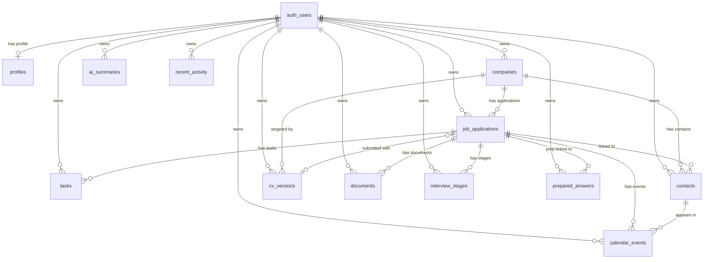

# InterviewFlow — Data Model

> Version: Phase 4 (Supabase)  
> Last updated: 2026-05-06  
> Migration files: `supabase/migrations/0001_init.sql`, `0002_rls.sql`, `0003_storage.sql`

---

## How to run locally

```bash
# 1. Install Supabase CLI
brew install supabase/tap/supabase     # macOS
# or: https://supabase.com/docs/guides/cli

# 2. Start local Supabase (Docker required)
supabase start

# 3. Run migrations + seed
supabase db reset
# This automatically runs:
#   supabase/migrations/0001_init.sql
#   supabase/migrations/0002_rls.sql
#   supabase/migrations/0003_storage.sql
#   supabase/seed.sql

# 4. View Studio
open http://localhost:54323
```

Migration execution order is determined by filename prefix: `0001` → `0002` → `0003`.

---

## ERD (Mermaid)



---

## Enum Types

| Enum | Values |
|------|--------|
| `application_stage` | `Interested`, `Applied`, `HR Screen`, `Home Assignment`, `Technical Interview`, `Manager Interview`, `Final Interview`, `Offer`, `Negotiating`, `Rejected`, `Withdrawn` |
| `priority_level` | `Critical`, `High`, `Medium`, `Low` |
| `task_status` | `Todo`, `In Progress`, `Done`, `Cancelled` |
| `task_category` | `Preparation`, `Follow-up`, `Application`, `Assignment`, `Research`, `Admin` |
| `work_model` | `Remote`, `Hybrid`, `On-site` |
| `company_size` | `1-50`, `51-200`, `201-500`, `501-2000`, `2001-10000`, `10000+` |
| `contact_type` | `Recruiter`, `Hiring Manager`, `HR`, `Interviewer`, `Referral`, `Employee`, `Other` |
| `interview_type` | `Phone Screen`, `HR Interview`, `Technical`, `System Design`, `Home Assignment`, `Manager Interview`, `Final Interview`, `Behavioral`, `Case Study` |
| `interview_outcome` | `Passed`, `Failed`, `Pending`, `Cancelled` |
| `calendar_event_type` | `Interview`, `Assignment Deadline`, `Application Deadline`, `Follow-up Reminder`, `Preparation Session`, `General Task`, `Reminder`, `Other` |
| `document_type` | `CV`, `Cover Letter`, `Home Assignment`, `Transcript`, `Certificate`, `Portfolio`, `Reference`, `Other` |
| `prep_category` | `Personal Pitch`, `Behavioral`, `STAR`, `HR`, `Technical`, `Product Sense`, `System Design`, `Case Study`, `Leadership Principles`, `Research` |
| `confidence_level` | `Low`, `Medium`, `High` |
| `ai_tool_type` | `Company Summary`, `JD Parser`, `Prepare Me`, `Interview Summary`, `Follow-up Message`, `Personalized Answer` |
| `activity_type` | `application_created`, `stage_changed`, `task_completed`, `interview_scheduled`, `offer_received`, `note_added`, `document_added`, `contact_added` |

---

## Tables

### `profiles`
One row per authenticated user. `id` = `auth.users.id` (not `gen_random_uuid()`).  
RLS uses `auth.uid() = id` (not `user_id`).

| Column | Type | Purpose |
|--------|------|---------|
| `id` | `uuid PK` | = auth user id |
| `user_id` | `uuid → auth.users` | redundant but included for schema consistency |
| `name` | `text` | Display name |
| `email` | `text` | Contact email |
| `university` | `text` | e.g. Bar-Ilan University |
| `year_of_study` | `integer` | Current academic year |
| `military_unit` | `text` | Optional, military or first-job context |
| `headline` | `text` | Short professional headline |
| `bio` | `text` | About paragraph |
| `skills` | `text[]` | Skill tags array |
| `avatar_url` | `text` | URL to profile photo |
| `created_at` | `timestamptz` | Row creation time |
| `updated_at` | `timestamptz` | Last update (auto-maintained by trigger) |

---

### `companies`
Companies the user is tracking or targeting.

| Column | Type | Purpose |
|--------|------|---------|
| `id` | `uuid PK` | |
| `user_id` | `uuid → auth.users` | Owner |
| `name` | `text` | Company name |
| `industry` | `text` | e.g. "E-commerce / Cloud / AI" |
| `size` | `company_size` | Headcount band |
| `location` | `text` | Primary office location |
| `website` | `text` | |
| `linkedin_url` | `text` | |
| `description` | `text` | Long-form description |
| `notes` | `text` | User's private notes on the company |
| `glassdoor_rating` | `numeric(3,1)` | 0.0–5.0 |
| `glassdoor_url` | `text` | |
| `tech_stack` | `text[]` | Key technologies |
| `logo_url` | `text` | Logo image URL |
| `created_at` | `timestamptz` | |
| `updated_at` | `timestamptz` | |

---

### `cv_versions`
Multiple CV variants tailored to different role types. Must be seeded before `job_applications` (FK dependency).

| Column | Type | Purpose |
|--------|------|---------|
| `id` | `uuid PK` | |
| `user_id` | `uuid → auth.users` | Owner |
| `company_id` | `uuid → companies` | Optional: company-specific variant |
| `name` | `text` | Human label, e.g. "Data-heavy v2.1" |
| `version_number` | `integer` | Numeric version |
| `emphasis` | `text` | Short description of focus |
| `skills_highlighted` | `text[]` | Skills this version foregrounds |
| `projects_highlighted` | `text[]` | Projects featured |
| `file_name` | `text` | Original filename |
| `file_size` | `integer` | Bytes |
| `storage_path` | `text` | Path in `cv-files` bucket: `{user_id}/{filename}` |
| `notes` | `text` | When to use this version |
| `is_active` | `boolean` | Whether this version is current |
| `created_at` | `timestamptz` | |
| `updated_at` | `timestamptz` | |

---

### `job_applications`
The central pipeline entity. Every other table (except `companies` and `cv_versions`) links back here.

| Column | Type | Purpose |
|--------|------|---------|
| `id` | `uuid PK` | |
| `user_id` | `uuid → auth.users` | Owner |
| `company_id` | `uuid → companies` | FK (restrict delete) |
| `company_name` | `text` | Denormalized for fast display |
| `role_name` | `text` | Job title |
| `role_url` | `text` | Link to original job posting |
| `job_description` | `text` | Full JD text (used by AI tools) |
| `stage` | `application_stage` | Current pipeline stage |
| `priority` | `priority_level` | User-assigned priority |
| `work_model` | `work_model` | Remote / Hybrid / On-site |
| `location` | `text` | Office location |
| `salary_min` | `integer` | Monthly salary (currency below) |
| `salary_max` | `integer` | |
| `currency` | `text` | ISO currency code, default `ILS` |
| `fit_score` | `integer` | 0–100, AI-computed or manual |
| `urgency_score` | `integer` | 0–100, AI-computed or manual |
| `why_interesting` | `text` | User's motivation note |
| `what_to_emphasize` | `text` | Interview talking points |
| `notes` | `text` | General notes |
| `submitted_cv_version_id` | `uuid → cv_versions` | Which CV was submitted |
| `submitted_cv_name` | `text` | Denormalized CV name |
| `applied_at` | `timestamptz` | Date application was submitted |
| `deadline_at` | `timestamptz` | Hard deadline (assignment, etc.) |
| `next_event_at` | `timestamptz` | Next calendar event timestamp |
| `next_event_description` | `text` | Short next event label |
| `created_at` | `timestamptz` | |
| `updated_at` | `timestamptz` | |

---

### `interview_stages`
Individual interview rounds within an application. Cascades on application delete.

| Column | Type | Purpose |
|--------|------|---------|
| `id` | `uuid PK` | |
| `user_id` | `uuid → auth.users` | Owner |
| `application_id` | `uuid → job_applications` | Parent application (cascade delete) |
| `type` | `interview_type` | Round type |
| `stage_order` | `integer` | Ordering within the application |
| `scheduled_at` | `timestamptz` | Interview date/time |
| `completed_at` | `timestamptz` | When it was completed |
| `duration_minutes` | `integer` | Expected/actual duration |
| `interviewer` | `text` | Name of the interviewer |
| `interviewer_title` | `text` | Their role |
| `location` | `text` | Zoom link, office address, etc. |
| `outcome` | `interview_outcome` | Result (default: `Pending`) |
| `notes` | `text` | Notes taken during/after |
| `feedback_received` | `text` | Recruiter feedback |
| `next_steps` | `text` | What comes next |
| `created_at` | `timestamptz` | |
| `updated_at` | `timestamptz` | |

---

### `tasks`
Action items: prep sessions, follow-ups, research, admin. Nullable `application_id` and `company_id` for standalone tasks.

| Column | Type | Purpose |
|--------|------|---------|
| `id` | `uuid PK` | |
| `user_id` | `uuid → auth.users` | Owner |
| `application_id` | `uuid → job_applications` | Optional (set null on delete) |
| `company_id` | `uuid → companies` | Optional (set null on delete) |
| `company_name` | `text` | Denormalized |
| `title` | `text` | Task title |
| `description` | `text` | Details |
| `category` | `task_category` | Type of work |
| `status` | `task_status` | Default: `Todo` |
| `priority` | `priority_level` | Default: `Medium` |
| `due_at` | `timestamptz` | Deadline |
| `completed_at` | `timestamptz` | When marked Done |
| `created_at` | `timestamptz` | |
| `updated_at` | `timestamptz` | |

**Key index:** `(user_id, due_at)` where `status NOT IN ('Done', 'Cancelled')` — powers the overdue tasks dashboard query.

---

### `contacts`
People at target companies: recruiters, hiring managers, referrals, etc.

| Column | Type | Purpose |
|--------|------|---------|
| `id` | `uuid PK` | |
| `user_id` | `uuid → auth.users` | Owner |
| `company_id` | `uuid → companies` | Optional (set null on delete) |
| `application_id` | `uuid → job_applications` | Optional (set null on delete) |
| `company_name` | `text` | Denormalized |
| `name` | `text` | Full name |
| `title` | `text` | Job title |
| `email` | `text` | |
| `linkedin_url` | `text` | |
| `type` | `contact_type` | Role in the hiring process |
| `notes` | `text` | Relationship notes |
| `last_interaction_at` | `timestamptz` | Last touchpoint date |
| `follow_up_due_at` | `timestamptz` | Reminder to follow up |
| `created_at` | `timestamptz` | |
| `updated_at` | `timestamptz` | |

---

### `calendar_events`
Interviews, deadlines, follow-up reminders, prep sessions.

| Column | Type | Purpose |
|--------|------|---------|
| `id` | `uuid PK` | |
| `user_id` | `uuid → auth.users` | Owner |
| `application_id` | `uuid → job_applications` | Optional (set null on delete) |
| `contact_id` | `uuid → contacts` | Optional (set null on delete) |
| `title` | `text` | Event title |
| `type` | `calendar_event_type` | Category |
| `company_name` | `text` | Denormalized |
| `application_name` | `text` | Denormalized role name |
| `starts_at` | `timestamptz` | Start time |
| `ends_at` | `timestamptz` | End time (nullable for point-in-time events) |
| `all_day` | `boolean` | Default: `false` |
| `location` | `text` | Address or "Zoom" |
| `meeting_url` | `text` | Video call link |
| `description` | `text` | Details |
| `reminder_minutes` | `integer` | Minutes before start to remind |
| `created_at` | `timestamptz` | |
| `updated_at` | `timestamptz` | |

**Key index:** `(user_id, starts_at)` — powers calendar page queries and upcoming deadlines widget.

---

### `documents`
Supporting files: cover letters, transcripts, portfolios, certificates. Actual files live in the `documents` storage bucket.

| Column | Type | Purpose |
|--------|------|---------|
| `id` | `uuid PK` | |
| `user_id` | `uuid → auth.users` | Owner |
| `application_id` | `uuid → job_applications` | Optional (set null on delete) |
| `name` | `text` | Display name |
| `type` | `document_type` | Document category |
| `file_name` | `text` | Original filename |
| `file_size` | `integer` | Bytes |
| `storage_path` | `text` | Path in `documents` bucket: `{user_id}/{filename}` |
| `notes` | `text` | |
| `created_at` | `timestamptz` | |
| `updated_at` | `timestamptz` | |

---

### `prepared_answers`
Interview prep Q&A library with optional STAR decomposition.

| Column | Type | Purpose |
|--------|------|---------|
| `id` | `uuid PK` | |
| `user_id` | `uuid → auth.users` | Owner |
| `application_id` | `uuid → job_applications` | Optional — company-specific answers |
| `question` | `text` | The interview question |
| `category` | `prep_category` | Type of question |
| `answer` | `text` | Full written answer |
| `star_situation` | `text` | S component |
| `star_task` | `text` | T component |
| `star_action` | `text` | A component |
| `star_result` | `text` | R component |
| `tags` | `text[]` | e.g. `['amazon', 'lp', 'dive-deep']` |
| `confidence` | `integer` | 1–5 self-assessment |
| `is_ready` | `boolean` | Whether answer is polished |
| `times_practiced` | `integer` | Practice count |
| `last_practiced_at` | `timestamptz` | |
| `last_updated_at` | `timestamptz` | When content last changed |
| `created_at` | `timestamptz` | |
| `updated_at` | `timestamptz` | |

---

### `ai_summaries`
Outputs from the six AI tools. Polymorphic: `entity_type` + `entity_id` point to any table (no FK constraint).

| Column | Type | Purpose |
|--------|------|---------|
| `id` | `uuid PK` | |
| `user_id` | `uuid → auth.users` | Owner |
| `tool_type` | `ai_tool_type` | Which AI tool was used |
| `entity_type` | `text` | `'application'` \| `'company'` \| `'contact'` \| `'answer'` |
| `entity_id` | `uuid` | ID of the related entity (no FK) |
| `input_data` | `jsonb` | Tool input fields (company name, role, JD text, etc.) |
| `output_data` | `jsonb` | AI-generated output sections (keyed by section name) |
| `is_mocked` | `boolean` | `true` for Phase 1–6 mock data |
| `created_at` | `timestamptz` | |
| `updated_at` | `timestamptz` | |

**`output_data` structure by tool:**

| Tool | Keys in `output_data` |
|------|----------------------|
| `Company Summary` | `mission`, `culture`, `recentNews`, `interviewTips`, `redFlags`, `fitAssessment` |
| `JD Parser` | `mustHaveSkills`, `niceToHaveSkills`, `keyResponsibilities`, `cultureFit`, `interviewFocus`, `coverageScore` |
| `Prepare Me` | `likelyTopics`, `practiceQuestions`, `studyPlan`, `prepTips` |
| `Interview Summary` | `keyMoments`, `whatWorked`, `whatToImprove`, `overallSentiment`, `nextSteps` |
| `Follow-up Message` | `subject`, `message`, `tone` |
| `Personalized Answer` | `answer`, `tips` |

---

### `recent_activity`
Append-only event log powering the dashboard feed. Events are written by application code; never mutated.

| Column | Type | Purpose |
|--------|------|---------|
| `id` | `uuid PK` | |
| `user_id` | `uuid → auth.users` | Owner |
| `activity_type` | `activity_type` | What happened |
| `entity_type` | `text` | Which table the entity lives in |
| `entity_id` | `uuid` | ID of the affected entity |
| `title` | `text` | Human-readable event title |
| `description` | `text` | Optional detail |
| `metadata` | `jsonb` | Extra context (stage old/new, etc.) |
| `created_at` | `timestamptz` | Event time |
| `updated_at` | `timestamptz` | Included for schema consistency; not used |

**Key index:** `(user_id, created_at DESC)` — powers the "Recent Activity" dashboard widget query.

---

## Storage Buckets

| Bucket | Visibility | Size limit | MIME types | Path convention |
|--------|-----------|------------|------------|-----------------|
| `cv-files` | Private | 5 MB | `application/pdf` | `{user_id}/{filename}` |
| `documents` | Private | 10 MB | PDF, DOCX, PNG, JPEG | `{user_id}/{filename}` |

All buckets use owner-only RLS policies: only the user whose `id` matches the first path segment can read/write.

**Generating a signed URL (Phase 5):**
```typescript
const { data } = await supabase.storage
  .from('cv-files')
  .createSignedUrl(`${userId}/${fileName}`, 3600) // 1-hour expiry
```

---

## Row Level Security

Every table has RLS enabled with four policies: `SELECT`, `INSERT`, `UPDATE`, `DELETE`.

- All user-owned tables: `USING (auth.uid() = user_id)`
- `profiles`: `USING (auth.uid() = id)` (because `id` = the auth user id)
- Storage objects: `(storage.foldername(name))[1] = auth.uid()::text`

No cross-user data access is possible at the database layer.

---

## Relationships Summary

| From | Column | To | Behavior |
|------|--------|----|----------|
| `job_applications` | `company_id` | `companies` | `ON DELETE RESTRICT` |
| `job_applications` | `submitted_cv_version_id` | `cv_versions` | `ON DELETE SET NULL` |
| `interview_stages` | `application_id` | `job_applications` | `ON DELETE CASCADE` |
| `tasks` | `application_id` | `job_applications` | `ON DELETE SET NULL` |
| `tasks` | `company_id` | `companies` | `ON DELETE SET NULL` |
| `contacts` | `company_id` | `companies` | `ON DELETE SET NULL` |
| `contacts` | `application_id` | `job_applications` | `ON DELETE SET NULL` |
| `calendar_events` | `application_id` | `job_applications` | `ON DELETE SET NULL` |
| `calendar_events` | `contact_id` | `contacts` | `ON DELETE SET NULL` |
| `cv_versions` | `company_id` | `companies` | `ON DELETE SET NULL` |
| `documents` | `application_id` | `job_applications` | `ON DELETE SET NULL` |
| `prepared_answers` | `application_id` | `job_applications` | `ON DELETE SET NULL` |
| `ai_summaries` | `entity_id` | *(polymorphic)* | No FK |

**Delete safety:** Deleting a `company` will fail if it has active `job_applications` (RESTRICT). Delete the applications first. All other relationships are nullable and cascade gracefully to `NULL`.

---

## Phase 5 Integration Notes (for the services layer)

When Phase 5 wires `applicationsService.ts` to Supabase:

```typescript
// List with company join
const { data } = await supabase
  .from('job_applications')
  .select('*, companies(name, glassdoor_rating, tech_stack)')
  .eq('user_id', userId)
  .order('urgency_score', { ascending: false })

// Dashboard: overdue tasks
const { data } = await supabase
  .from('tasks')
  .select('*')
  .eq('user_id', userId)
  .not('status', 'in', '("Done","Cancelled")')
  .lt('due_at', new Date().toISOString())
  .order('due_at', { ascending: true })

// Recent activity feed
const { data } = await supabase
  .from('recent_activity')
  .select('*')
  .eq('user_id', userId)
  .order('created_at', { ascending: false })
  .limit(10)
```

The `user_id` filter is technically redundant when RLS is enabled (the DB enforces it), but including it explicitly makes query intent clear and enables easier local testing with RLS disabled.
